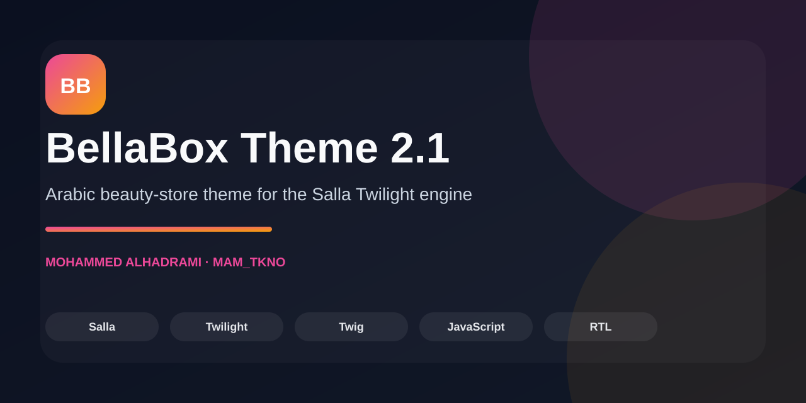
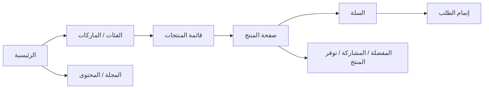

# BellaBox Theme 2.1




**Conversion-focused Arabic beauty-store theme for the Salla Twilight engine.**

[Store Reference](https://bellaboxksa.com/) · [Theme Config](twilight.json) · [Product Page](src/views/pages/product/single.twig) · [Cart](src/views/pages/cart.twig) · [Main JS](src/assets/js/main.js)

ثيم BellaBox متوافق مع **Salla Twilight Theme Engine** لمتاجر الجمال والعناية. يعتمد على صفحات Twilight الرسمية ومكوّنات Salla الجاهزة، مع واجهة عربية RTL تركّز على وضوح الاكتشاف، تفاصيل المنتج، التواصل، والتحويل على الجوال.

## Portfolio Proof

| البعد | الدليل |
|---|---|
| **المشكلة** | متجر عربي للجمال يحتاج تجربة RTL متماسكة دون الخروج عن دورة حياة ومكوّنات Salla Twilight. |
| **الحل** | ثيم مخصص يعيد بناء الاكتشاف وصفحات المنتجات والسلة والمحتوى مع الاعتماد على بيانات ومكوّنات سلة الرسمية. |
| **واجهة المنتج** | [صفحة المنتج](src/views/pages/product/single.twig) · [قائمة المنتجات](src/views/pages/product/index.twig) |
| **الشراء** | [السلة](src/views/pages/cart.twig) |
| **تكامل الثيم** | [twilight.json](twilight.json) · [main.js](src/assets/js/main.js) |
| **الحالة الحالية** | الكود مكتمل على مستوى الثيم، بينما التحقق البصري النهائي يحتاج معاينة متجر Demo داخل Salla Partners. |


## Storefront Flow



## ما تم استكماله

- نظام بصري موحد بخط Cairo، ألوان وردية/ترابية هادئة، حالات hover وfocus، واستجابة كاملة.
- رأس متجر فعلي مع شريط إعلان، تنقل سطح المكتب والجوال، بحث، حساب، ومكوّن السلة الرسمي الذي يعرض العدد الحقيقي.
- حالة تنقل نشطة تلقائية بين الرئيسية والمنتجات والعروض والماركات والمجلة، مع دعم لوحة مفاتيح وإغلاق قائمة الجوال بزر Escape.
- الصفحة الرئيسية مع مقدمة تحريرية، نقاط ثقة، مسارات اكتشاف واضحة، مكوّنات Salla Home الديناميكية، دليل تحريري، وأسئلة شائعة مرتبطة بالترجمة.
- صفحة قوائم المنتجات مع الفلاتر، الفرز، التصفح اللانهائي، مسارات التنقل، وبطاقات تعرض السعر والتقييم والمفضلة وحالة التوفر.
- صفحة المنتج المفرد مع الصور المصغرة، السعر، الخصم، التقييم، الوسوم، الخيارات، الملاحظات، الكمية، الإضافة للسلة، التقسيط عند توفره، إشعار التوفر عند نفاد المخزون، معلومات الشحن والدعم، المشاركة الاجتماعية، التقييمات، والمنتجات المرتبطة.
- صفحة السلة مع تحديث الكمية، الحذف، مؤشر الشحن المجاني، الكوبونات، وملخص الطلب.
- صفحات المجلة: قائمة المقالات، التصنيفات، المقال المفرد، الوسوم، الإعجاب والتعليقات، والمقالات المرتبطة.
- صفحات الماركات: قائمة الماركات وصفحة الماركة مع منتجاتها.
- الصفحات الرسمية الأخرى في Twilight: الحساب، الطلبات، تفاصيل الطلب، المفضلة، الإشعارات، المحفظة، الولاء، الشكر، الصفحة الثابتة، وصفحة الهبوط.
- تذييل واضح بخيارات هاتف، بريد، واتساب، الشبكات الاجتماعية، سياسات المتجر، وطرق الدفع الآمن بدل نموذج اشتراك شكلي غير مربوط بخدمة خارجية.
- إعدادات `twilight.json` للتحكم في الرأس، التذييل، الإشعارات، الشريط المثبت، مسارات التنقل، ووسوم المنتجات.

## البنية

```text
src/
├── assets/
│   ├── js/main.js
│   └── styles/
├── locales/
├── views/
│   ├── components/
│   ├── layouts/
│   └── pages/
└── twilight.json
```

## التشغيل والتحقق

يتطلب المشروع Node.js وSalla CLI. بعد تسجيل الدخول إلى Salla CLI:

```bash
npm install
npm run dev      # salla theme preview
npm run build    # salla theme doctor
npm run publish  # بعد تسجيل الدخول وتجهيز الثيم في Partners Portal
```

أثناء التطوير على سلة يفضل استخدام:

```bash
salla theme preview
```

لأن المعاينة الرسمية توفر بيانات المتجر، المكوّنات، المنتجات، الحساب، والسلة كما تظهر في بيئة Twilight الحقيقية.

## ملاحظات تكامل مهمة

- أسماء ومسارات صفحات Twilight الرسمية لا ينبغي تغييرها؛ لذلك تم الحفاظ على الصفحات داخل `src/views/pages` كما هي محددة في توثيق Twilight.
- المنتجات والصور والمقالات لا تحتوي على بيانات وهمية داخل الثيم؛ يتم عرضها من كائنات Salla ومكوّناتها الرسمية.
- صفحة المنتج تعتمد على `salla-installment` و`salla-product-availability` و`salla-social-share`، وتظهر هذه الوظائف بحسب إعدادات المتجر وتوفر المنتج والخدمة.
- أي صفحة ثابتة مثل سياسة الشحن أو الخصوصية يمكن إدارتها من لوحة سلة وتظهر عبر `page-single.twig`.
- بيانات الهاتف والبريد وواتساب والعنوان تُقرأ من إعدادات المتجر، لذلك يجب إكمالها من لوحة سلة قبل المعاينة النهائية.
- لا يلزم تعديل `main.js` عند إضافة منتجات أو أقسام؛ المكونات الرسمية تتولى البيانات، بينما يتولى الثيم العرض والتفاعل العام.

## التحقق المنفذ

تم التحقق من صحة ملفات JSON وJavaScript، ومراجعة مراجع القوالب والجزئيات، والتأكد من وجود جميع مسارات الصفحات الرسمية. تم أيضًا إزالة تفاعل النشرة الوهمي، وربط المفضلة بمكالمات Salla SDK، وإضافة مكوّنات Twilight الرسمية لتوفر المنتج والتقسيط والمشاركة. يتبقى اختبار المعاينة المرئية داخل متجر Demo في Salla Partners للتأكد من بيانات المتجر الفعلية وتوافق Web Components مع إصدار الحساب.
